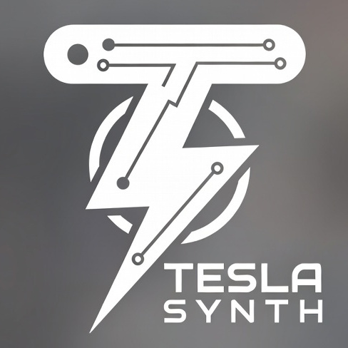

<p align="center">
  
</p>

<p align="center">
  <strong>Teslasynth</strong> — MIDI synthesizer firmware for ESP32
  <br/>
  
  <a href="http://projects.hnaderi.dev/teslasynth/"></a>
  
  <br>
  <a href="https://pypi.org/project/teslasynth/"></a>
</p>

Teslasynth is open-source MIDI synthesizer firmware for ESP32 family that turns
interruptible high-voltage devices — Tesla coils, flyback transformers,
high-power lasers — into musical instruments.

**Full documentation:** http://projects.hnaderi.dev/teslasynth/

## ⚠ Safety

**This firmware controls high-voltage and high-power devices. These are
dangerous.**

- Tesla coils and flyback transformers produce lethal voltages.
- High-power lasers can cause permanent eye damage and fire.
- Never work on live circuits. Always discharge capacitors first.
- The firmware has no awareness of what it is connected to. Safe operation is
  the responsibility of the builder and operator.

## Quick start

1. Open the [web installer](http://projects.hnaderi.dev/teslasynth/) in Chrome or
   Edge and flash your ESP32 board.
2. Connect to the Wi-Fi network **Teslasynth** (default password:
   `Wardenclyffe1891!`).
3. Open **http://teslasynth.local** (or **http://192.168.4.1** if mDNS doesn't
   work on your device).
4. Configure the device using the web dashboard.
5. Connect a MIDI source and play.

## ⚠ Before connecting high-voltage hardware

**Please read the [Configuration](http://projects.hnaderi.dev/teslasynth/configuration) page carefully before any
high-voltage tests.**

## Python library

```sh
pip install teslasynth
```

Render MIDI files offline, visualise pulse signals, and tune safety parameters
before connecting any hardware. See the
[Python docs](http://projects.hnaderi.dev/teslasynth/python) for details.
